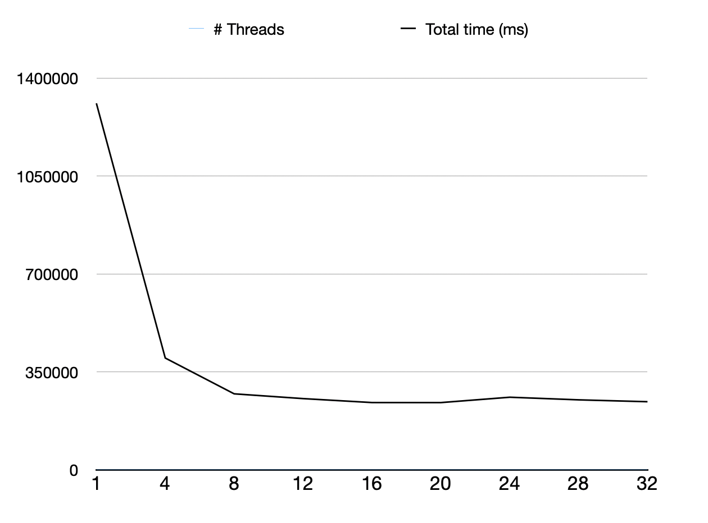

Author: Zanatta Giacomo - 859156  
A.Y. 2020/2021
# High Performance Computing Project
## QuickStart
# Table of Contents
1. [Introduction](#Introduction)
   1. [Frequent Itemset Mining](#frequent-itemset-mining )
   2. [A  Priori Algorithm](#a-priori-algorithm)
   3. [Information about the project](#information-about-the-project)
2. [Implementation](#implementation)
3. [Dataset](#dataset)
4. [Parallel Implementation with OPENMP](#parallel-implementation-with-openmp)
   1. [Parallelization on L set generation](#parallelization-on-l-set-generation)
   2. [Parallelization on C set generation](#parallelization-on-c-set-generation)
5. [Analysis](#analysis)
   1. [Serial](#serial)
   2. [Parallel](#parallel)
   3. [Auto vectorization and loop optimization](#auto-vectorization-and-loop-optimization)
6. [Notes](#notes)
   1. [Map Reduce approach](#map-reduce-approach)


## Introduction
### Frequent Itemset Mining 
This project aims to implements a Frequent-Itemset Mining algorithm, both in sequential and parallel way, and to analyze and discuss performance and implementation choices.
The Frequent Itemset problems is defined as follows:  
 - An **Itemset** is a collection of one or more items.
   - **Support**: frequency of occurrence of an itemset in a set of Transaction. This can be represented also as a fraction. If the support for an itemset is 40%, for example, we expect that in 40% of our transaction the itemset is present.  
 - **Frequent Itemset**: is an itemset whose support is greater than or equal to a threshold (minsup).
 - The goal, starting from a set of Transaction T over a set of items I, is to find all itemsets with items contained in I that have the support above or equal the threshold defined.
### A Priori Algorithm
We implemented the A-Priori Algorithm, that is based on the main principle that if an itemset is frequent then also all of its subset must be frequent. Viceversa, if an itemset is not frequent, than all of its superset cannot be frequent.  
Is a level-base approach to find Frequent Itemset 
We will discuss about the implementations and performances on the next sections.
### Information about the project
The implementation was made using C++ on a macOS environment and the gcc compiler.  
For the parallel implementation, openMP library was used. It is an High-Level library for create multi-threading program. The usage of OpenMP avoids to change the code too much and it is easier to understand and more readable since it is based on directives.  
The parallel implemention can be found on the parallel branch of the repo.  
The serial one is in the serial branch.  
## Implementation
The A-Priori implementation was done as follows:
- Since we are working with a list of transactions, and a transaction is a set of items, we store the transaction in a vector of vector of int. We scan transaction sequentially, so using vectors fit well for this requirement.  
- When we parse the file in the transaction structure, we create also another data structure that contains the counting of items. This avoid to scan the whole transaction list another time when we generate C1. We use a map from int (item) to int (the number of this item in transactions) for this purpose.  
- The first step of A-Priori is to get the first Candidate set. We use the previous mentioned map to generate C1, i.e. the candidate set of itemset with length 1.  
  - The candidate set has type of **map<vector<int>, <int>>**. We use this data structure for the main reason that accessing elements in map has logarithmic complexity. The key is **vector<int>** type because we need to store itemsets, that could have different length, step-based (i.e. on step 1, all item contains only one element, on step 2, we have two elements and so on).  
- While the current candidate set is not empty:  
  - We generate L: for every item in the current candidate set (that is the key of the C map, **vector<int>**), we count of many times it appears in all transasctions (support). If the support is above the minimum support, this item is inserted into the set L.
  - We generate the next C starting from L. The process of generating C consists of two phase:
    - joining: the joining phase will merge two different sets of length N-1 to K sets of length N.
    - prune: the pruning phase removes sets in C of length N that does not have all the subsets in L.

## Dataset
We tested the implementation with the retail dataset.  
This dataset is not dense in terms of items and contains circa 80000 transactions of different length.  
Other dataset tested are the chess ones, but this has only 75 different item with fixed transaction length of 35 and only 3000 transactions. Using the chess dataset we expect to find a lot of frequent itemsets.  
The retail dataset consists of 88162 transactions.  
## Parallel Implementation with OPENMP
Now we are going to analyze how to introduce parallelism on this project.  
Fist, we need to find the part of the code that can be parallelized.  
- Every apriori phase depends on the previous ones, so we cannot apply parallelization here.  
- Instead, we can try to add parallelization on the internal C and L set generation.  
### Parallelization on L set generation
For generate L, we iterate through the C set. 
Since every element in C is unique and independent, we can try to add parallelization here.  
The for loop that iterate through C is parallelized. Every thread works on a local L variable.  
When they are done, all the localLs are merged together in the global L variable. This is done in a critical section.  
Note that for every element in C we need to perform counting, i.e. find the support of c ∈ C in every t ∈ T.  
We can parallelize also this step, but we avoid doing it because we don't want to introduce a lot of overhead.
### Parallelization on C set generation
We do the same things for the C set generation:    
- The external for loop of the join phase is parallelized.  
  - We add a critical section for merging outputs of every thread.  
- This works also for the prune phase (for loop parallelized and critical section at the end).  
We now provide the code snippet for these sections.   
The library chrono was used to extract timing information about each step.  
```
/**
 * Find the frequent itemset from a candidate set C.
 * For every candidate item i in C, this function counts the number of transaction that contains i (support).
 * If the support of i is above the minimum support, then this item is added to the frequent itemset.
 * @param C - the candidate set
 * @param minSupport - the min support
 * @return the frequent itemset.
 */
map<vector<int>, int> Transactions::generateL(map<vector<int>, int> C, int minSupport) {
    map<vector<int>, int> L;
    #pragma omp parallel
    {
        map<vector<int>, int> localL;
        #pragma omp for
        for (int i = 0; i< C.size(); i++) {
            auto it = C.begin();
            advance(it, i);
            // for every row in C, check if the support is > minSupport
            int supp = getRowSupport(it->first);
            if (supp>minSupport) {
                localL[it->first] = supp;
            }
        }
        #pragma omp critical
        {
            for (auto item:localL) {
                L[item.first] = item.second;
            }
        }
    }
    return L;
}

/**
 * Generate the C set (Candidate set) from the previous frequent itemset.
 * This is done in 2 phases:
 * 1. Join Phase: merge together 2 item from L. This will generate, starting from items with length N, items with length N+1.
 * 2. Prune Phase: remove from the set generated before items that does not have all k-subset to be frequent
 * @param L - the frequent itemset with item length N-1.
 * @return the Candidate set with item length N.
 */
map<vector<int>, int> Transactions::generateC(map<vector<int>, int> L) {
    map<vector<int>, int> C;

    return prunePhase(joinPhase(L), L);
}

map<vector<int>, int> Transactions::joinPhase(map<vector<int>, int> L) {
    map<vector<int>, int> joinedC;
    #pragma omp parallel
    {
        map<vector<int>, int> localC;
        #pragma omp for
        for (int i = 0; i < L.size(); i++) {
            auto it = L.begin();
            advance(it, i);
            vector<int> row = it->first;
            auto internalIt = it;
            internalIt++;
            while( internalIt != L.end()) {
                for (auto item:internalIt->first) {
                    if (find(row.begin(), row.end(), item) == row.end()) { // not found
                        vector<int> joinItems = row;
                        joinItems.push_back(item);
                        sort(joinItems.begin(), joinItems.end());
                        localC[joinItems] ++;
                    }
                }
                internalIt++;
            }
        }
        #pragma omp critical
        {
            for (auto item:localC) {
                joinedC[item.first] = item.second;
            }
        }
    }
    return joinedC;
}

map<vector<int>, int> Transactions::prunePhase(map<vector<int>, int> C, map<vector<int>, int> L) {
    map<vector<int>, int> prunedC;
     #pragma omp parallel
    {
        map<vector<int>, int> localC;
        #pragma omp for
        for (int i = 0; i < C.size(); i++) {
            auto row = C.begin();
            advance(row, i);
            int i;
            for(i=0; i<row->first.size();i++){
                vector<int> rowSubset = row->first;
                rowSubset.erase(rowSubset.begin()+i);
                if (!L[rowSubset]) {
                    break;
                }
            }
            if(i==row->first.size()){
                localC[row->first]++;
            }
        }
        #pragma omp critical
        {
            for (auto item:localC) {
                prunedC[item.first]++;
            }
        }
    }
    return prunedC;
}

```
For coherence, we add also the codesnippet for the whole apriori algorithm:  
```
void apriori(Transactions *transactions, int minSupport) {

    auto begin = std::chrono::high_resolution_clock::now();

    map<vector<int>, int> C = transactions->getC1();
    int step = 1;
    while(!C.empty()) {
        cout << "STEP  " << step << endl;
        auto begin = std::chrono::high_resolution_clock::now();

        map<vector<int>, int> L = transactions->generateL(C, minSupport);
        auto end = std::chrono::high_resolution_clock::now();
        auto elapsed = std::chrono::duration_cast<std::chrono::milliseconds>(end - begin);
        cout << "generate L total time: " << elapsed.count() << "ms." << endl;

        cout << "# Frequent itemset of size " << step << ": " << L.size() << endl;
        auto beginC = std::chrono::high_resolution_clock::now();
        C = transactions->generateC(L);
        end = std::chrono::high_resolution_clock::now();
        elapsed = std::chrono::duration_cast<std::chrono::milliseconds>(end - begin);
        cout << "generate C total time: " << elapsed.count() << "ms." << endl;
        step++;
        end = std::chrono::high_resolution_clock::now();
        elapsed = std::chrono::duration_cast<std::chrono::milliseconds>(end - begin);
        cout << "apriori step " << step << " total time: " << elapsed.count() << "ms." << endl << endl;
    }
    auto end = std::chrono::high_resolution_clock::now();
    auto elapsed = std::chrono::duration_cast<std::chrono::milliseconds>(end - begin);
    cout << "apriori parallel total time: " << elapsed.count() << "ms." << endl;
}
```


## Analysis
We analyze now how the program works with the retail dataset and min support of 1000 (e.g. at least circa 1.1 % of support).  
In this case, we are going to search the itemset that compares in at least 1000 transactions.  
We have: 56 frequent items of size 1, 49 frequent items of size 2, 24 frequent items of size 3, and 6 frequent item of size 4.  
We set the number of thread via "export OMP_NUM_THREADS".  

### Serial
- STEP 1: Number of Frequent items: 56  
  - Total time: 1198138ms  
- STEP 2: Number of Frequent items: 49  
  - Total time: 109061ms  
- STEP 3: Number of Frequent items: 24  
  - Total time: 2089ms  
- STEP 4: Number of Frequent items: 6  
  - Total time: 398ms  
- STEP 5: C is empty, so we are done.  
- TOTAL TIME: 1309729ms  

### Parallel
We try with different degree of parallelism: 4,8,12,16,20,24,28,32 threads.
In the table we report the different time taken for every step and for every number of threads.

| # Threads | STEP 1      | STEP 2      | STEP 3      | STEP 4      | TOTAL TIME |
| -----------       | ----------- | ----------- | ----------- | ----------- | ----------- |
| 1            | 1198138ms       | 109061ms | 2089ms | 398ms | 1309729ms
| 4            | 363822ms     | 34566ms | 727ms | 179ms | 399340ms
| 8            | 248137ms       | 22612ms | 497ms | 96ms | 271388ms
| 12           | 231003ms      | 22706ms | 457ms | 96ms | 254306ms
| 16           | 218333ms      | 21274ms | 438ms | 93ms | 240183ms
| 20           | 218774ms       | 20622ms | 479ms | 118ms | 240034ms
| 24           | 234720ms      | 23873ms | 480ms | 105ms | 259224ms
| 28           | 21832ms       | 21832ms  | 277ms | 92ms | 249857ms
| 32           | 220337ms    | 22231ms | 457ms | 106ms | 243173ms

This is the graph obtained by analyzing total time for every number of threads.  
We not that when we reach 16/20 number of threads we have the best performance.  
This is because adding threads not always make the performance better, because we need to keep into account that we have some critical phase, needs to be performed serially for every threads and this is prune to some overhead.
### Auto vectorization and loop optimization
For doing this, we need to change our data structure in array. C++ map is implemented using trees and this is a tradeoff: we perform a lot of searches in the dataset so a tree fits weel. If we use array we need to keep the data sorted for better accessing elements.  
For this reason we prefer to keep the map data structure.
- We can try to compile the code with the -O3 flag:
    - We use number of thread = 16.

| # Threads | STEP 1      | STEP 2      | STEP 3      | STEP 4      | TOTAL TIME |
| -----------       | ----------- | ----------- | ----------- | ----------- | ----------- |
| 16          | 95328ms       | 8391ms | 2089ms | 181ms | 103949ms

With the -O3 flag, the code is compiled in a more efficiently way: with 16 threads we took only 103949ms (1.7 min. circa) to finish instead of 240183ms (4 min. circa).
## Notes
### Map Reduce approach
- We can also use a map-reduce approach to perform this task:  
  - We split the input in N subset, everyone associated with a mapper (M1= T1,T2,T3, M2=T4,T5,T6, ...)
  - Mapper function will count how many times an item is present in his transactions subset.  (Output will be, for example: M1 = (I1,3),(I2,2), (I3,1), M2=(I1,2),(I2, 3),...)
  - Then a shuffer phase will merge the counting of every mappers with item ID: R1=({I1: 3,2,...}, {I2: 5,1,...}), R2=({I3: 1, 2,...}), ...
  - Reducer works on output of shuffer phase, summing up its values: R1={I1: 5, I2: 6,...}, R2={I3: 3, I4: ...,...})